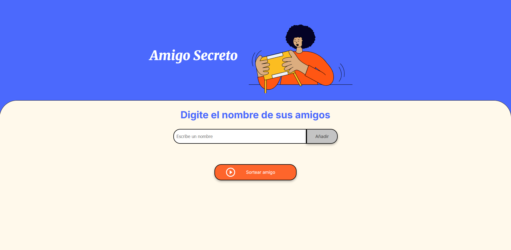
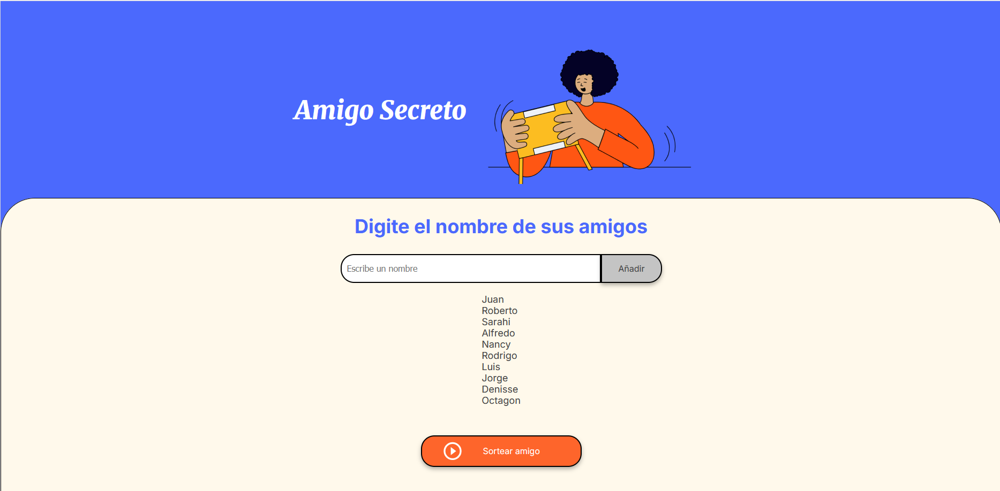
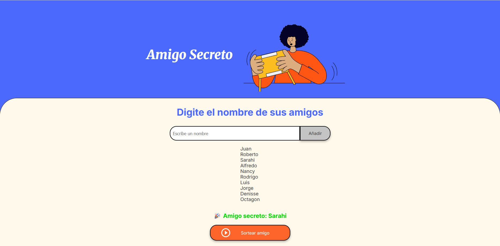

# Amigo Secreto
### Proyecto Challenge "Amigo Secreto" en Alura Latam

Este es un proyecto sencillo realizado con el objetivo de poner en práctica mis conocimientos y habilidades con JavaScript.

## !Juega Amigo Secreto!

Permite escribir nombres de amigos en una lista y luego hacer un sorteo para elegir uno al azar como amigo secreto.

## Funcionamiento

1. Escribir un nombre en el campo de texto.
2. Presionar el botón "Añadir" para agregarlo a la lista.
3. Cuando se hayan agregado todos los nombres, presionar el botón "Sortear amigo".
4. El programa mostrará el nombre elegido en la parte inferior.

## Vista Previa
Pantalla Principal:

## Archivos del proyecto

- index.html 
- style.css 
- app.js
- assets

### Proyecto realizado por Guillermo Hernández Cruz
